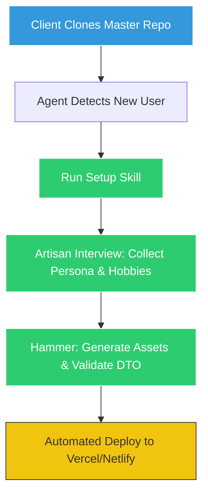

# 💼 Business Model: Agentic Portfolio-as-a-Service (APaaS)

## 1. Value Proposition: "The 5-Minute Professional Brand" ⏱️
Standard freelancers take weeks to build a custom portfolio. Your business model uses the **Artisan Interview Skill** 🗣️ to extract a client's "vibe" and the **Hammer Command** 🔨 to guarantee a bug-free, accessible, and SEO-optimized site in minutes.

## 2. Scalability Strategy: The "Clone & Prompt" Engine 🐑
To make this easy to copy and set up for others, we modularize the "Persona" from the "Engine."

### A. The Core Engine (The "Stainless Steel" Repo) ⚙️
Maintain a master "Boilerplate" repository containing:
- The full `.agent/` folder structure. 📂
- The Zod DTO validation logic. 🛡️
- The Playwright/Vitest testing suite. 🧪
- The Steampunk (or any other) UI components. 🎩

### B. The Personalization Layer (The "Vibe" Config) 🎨
A client setup only requires three steps:
1. **Persona Update**: Replace `maker_craftsman.rules.md` with the client's specific hobby/work rules. 📝
2. **Visual Re-brand**: Update `visualization.rules.md` with the client's brand colors (Mermaid CSS classes). 🖌️
3. **The Interview**: Run the `artisan_interview.skill` to populate `projects.ts` and generate i18n locales. 🎤

## 3. Productization Tiers 💰

| Tier | Name | Deliverable | Automation Level |
| :--- | :--- | :--- | :--- |
| **Tier 1** | The Automated Core 🤖 | Raw repo + `.agent` setup guide for developers. | 100% (Passive Income) |
| **Tier 2** | The Guided Vibe 🧘 | You run the "Artisan Interview" for them + GenAI asset creation. | 80% (High Margin) |
| **Tier 3** | The Dual Nature Pro ☯️ | Custom Roles + Deep SEO + Custom KPI Dashboard integration. | 50% (Bespoke Price) |

## 4. Investment & ROI Analysis 📈

Building a sophisticated "Agentic Prompt Contingent" (a library of high-quality Rules, Skills, and Commands) is a front-heavy investment that yields long-term compounding returns. 🏗️

### A. The Investment Cost 💸

- **Prompt Engineering Time**: 40–80 hours to reach "Production-Grade" stability across all personas. ⏳
- **Tooling/Compute**: Minimal during development (~$20/mo for IDE Pro tiers), but increases with high-volume agentic missions. 💻
- **Maintenance**: Expect ~15% recurring "drift management" to keep prompts aligned with evolving LLM models. 🔧

### B. The Return Ratio (ROI) 🚀

- **Time Arbitrage**: While a standard portfolio takes 20+ hours, your framework drops it to <1 hour. ⏱️
- **Profit Margin**: By selling the "outcome" (a high-end brand) rather than the "hours," your effective hourly rate increases by 5x to 10x. 💹
- **Scalability**: Once the "Hammer" is robust, you can onboard 5 clients in the time it used to take to onboard 1. ⚖️

## 5. Technical Scalability (Agentic Deployment) 🚀
To make this "easy to copy," we use a Mermaid-driven onboarding flow:

## 6. Marketing the "QA Specialist" Edge 🎖️
Unlike other portfolio builders, your "unique selling point" (USP) is the Hammer.

- **The Pitch**: "I don't just build your site; I give you an AI Agent that lives in your code to ensure it never breaks and stays accessible forever." 📢
- **Visual Proof**: Use the `VISUAL_MAP.md` as a sales tool to show clients how their site "thinks" and "validates" itself. 🗺️

## 7. Next Steps for Launch 🚀
- **Template-ize**: Strip Gabor-specific mentions from the core components. 🧹
- **Generalize DTO**: Ensure `ProjectDTOSchema` is flexible enough for any industry (e.g., "Developer", "Chef", "Lawyer"). 🧑‍🍳
- **One-Click Setup**: Create a `bin/setup.sh` that initializes the Antigravity environment for a new user. 🖱️