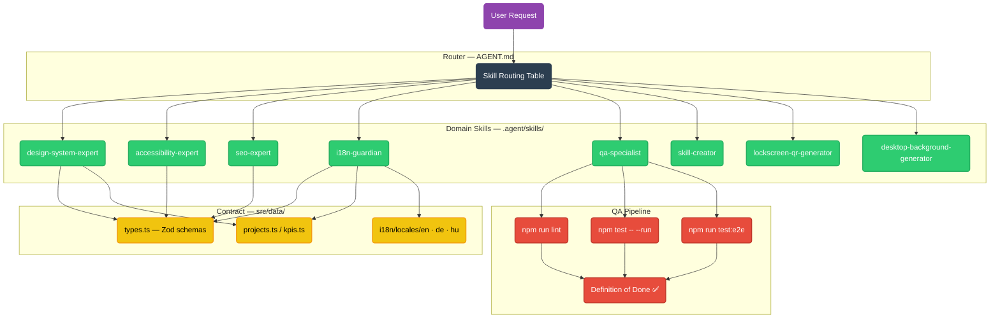

# GaborPortfolio Agent Router

This is the primary entrypoint. Read this first every session to understand the project context and route to the correct skill(s).

## Project Identity
**GaborPortfolio** — A multilingual (EN/DE/HU) SPA (Client-Side Rendering) showcase site for a QA Engineer & Artisan Maker. Aesthetic: "Fancy Steampunk Futuristic Elegant Dark Mode". Stack: React + TypeScript + Vite + Vitest + Playwright.

## Working Principles

- **Be honest, push back.** If Gábor proposes a plan that is flawed, inefficient, redundant, missing a step, or based on a wrong assumption — say so directly and propose the better path. Do not silently comply with a bad plan. Do not soften critique to be polite. Do not let him "do bullshit." Disagreement is a feature, not friction.
- **Stop & Debate Protocol**: Whenever a suboptimal, redundant, or "bullshit" path is detected, the Agent MUST immediately stop and initiate a technical debate, regardless of task delays.
- **Mandatory Critique**: Every `implementation_plan.md` MUST contain an "Honest Critique" section challenging at least one user assumption or proposing a superior alternative.
- **Release Management Protocol**: Every task MUST follow the 7-step cycle:
    1. **Initialization**: Create a `feature/<short-desc>` branch.
    2. **Design**: Submit an implementation plan with an Honest Critique.
    3. **Execution**: Perform local changes + full DoD (lint, unit, e2e).
    4. **Local Review**: Provide a "Review Brief" summarizing technical decisions and diffs.
    5. **Staging Approval**: Commit & Push ONLY after explicit human "GO" on the brief.
    6. **Remote MR Advice**: Generate a reviewer checklist for the human to use on GitHub/GitLab.
    7. **Final Merge**: Human executes merge after a second "GO" in the MR context.
- **Unconditional User Approval**: No changes are executed before explicit plan approval.

## Repo Hygiene (proactive — don't wait to be asked)

At the start of every session, silently scan for drift and inconsistency. If you find issues, raise them before starting the requested work. Examples:

- **Stale docs**: project-refs.md has outdated page IDs; a skill's description doesn't cover a sub-command that was added.
- **Orphaned files**: Files in `/outputs/` that should have been archived into a VCP folder; duplicate files across directories.
- **Naming violations**: VCP folders with spaces instead of hyphens; files in the wrong location per convention.
- **Skill/config divergence**: A skill hardcodes a value that should come from `project-refs.md`; a sub-command exists in code but not in the skill's documentation.
- **Dead references**: Links to deleted files; config entries pointing to moved content.
- **BACKLOG.md drift**: Items marked `[/]` with no active branch → reset to `[ ]`. Items `[ ]` older than 90 days → propose `[~]`. `[x]` items not yet moved to Archive → move them.

When flagging issues: state what's wrong, where, and propose a fix. Do not silently fix without telling Gábor — the point is visibility, not surprise edits. Bundle related issues into one concise list rather than interrupting with each individually.

If no issues are found, say nothing — don't waste time reporting a clean bill of health.

## Backlog Protocol

`BACKLOG.md` (repo root) is the single source of truth for all open work. The Agent MUST maintain it automatically using these three hooks:

### Hook 1 — Session Start (silent)
During the Repo Hygiene scan, also check `BACKLOG.md`:
- `[/]` items with no matching active branch → reset to `[ ]`
- `[ ]` items older than 90 days → flag for `[~]` deferral
- `[x]` items outside the Archive section → move them to `## Archive`

### Hook 2 — Task Completion (mandatory)
Before every commit, the Agent MUST:
1. Mark related `BACKLOG.md` items `[x]`
2. Add any newly discovered tasks as `[ ]` items
3. Include `BACKLOG.md` in the same commit as the completed work

### Hook 3 — New Idea Capture (immediate)
Whenever Gábor says *"we should…"*, *"idea:"*, *"what about…"*, or *"can we also…"*:
1. Add the idea to `BACKLOG.md` as a `[ ]` item immediately
2. Do NOT start working on it — confirm it is logged, then return to the current task
3. New ideas start as `[?]` if they require a decision before becoming actionable

> **Schema reminder**: `- [STATUS] **[CATEGORY]** Description — \`reference\` _(added: YYYY-MM-DD)_`
> Valid statuses: `[ ]` open · `[/]` in progress · `[x]` done · `[?]` needs decision · `[~]` deferred

## Context Efficiency Rules
Load only the skills the current task genuinely needs. Skill files cost tokens on every load.

| Situation | Action |
|---|---|
| Task touches one clear domain | Load only that skill |
| Task touches multiple domains | Load all matching skills — cross-links inside each skill resolve conflicts |
| Uncertainty about which skill applies | Re-read the trigger keywords in the routing table below before loading |
| Read-only question (no code change) | Answer from memory if possible; only load a skill if the answer requires its rules |

**Token Efficiency (Native RTK)**:
The Agent MUST prefix all "noisy" commands (npm test, npm run lint, git log, git diff, build) with `rtk` (e.g., `rtk npm test`). This reduces context noise by up to 90%. Refer to `.agent/rules/antigravity-rtk-rules.md` for logic details.

**Quality is non-negotiable** — never skip a required skill to save tokens. The efficiency goal is to avoid loading *irrelevant* skills, not to shortcuts QA or correctness.

### 🛡️ Mandatory Pre-flight Check
Before performing any task, the Agent MUST:
1.  **State loaded skills**: Explicitly list which skills from the Routing Table were loaded.
2.  **Justify trigger**: Explain *why* each skill was loaded based on keywords or context.
3.  **UI Work Load-out**: If the task involves a UI component or page layout, ALWAYS consider loading the "Core Trio": `design-system-expert` + `accessibility-expert` + `i18n-guardian`.
4.  **Check for missing skills**: If no skill fits, trigger `skill-creator` immediately.

## Skill Routing Table

| Trigger keywords / context | Load skill |
|---|---|
| CSS, layout, mobile, overflow, flexbox, grid, image, asset, thumbnail, Steampunk, animation, content copy, hobby description, artisan, Mission Control, Zero-Selector, rAF, 3D Carousel, 60fps, IntersectionObserver, refactor component, new feature | `design-system-expert` |
| SEO, meta, Open Graph, hreflang, Lighthouse, LCP, CLS, JSON-LD, robots, sitemap, SPA SEO, performance, page update, asset change, loading speed, rendering | `seo-expert` |
| WCAG, accessibility, aria, a11y, axe, screen reader, contrast, keyboard, skip-link, UI refactor, component logic, html structure, interactive element | `accessibility-expert` |
| translation, locale, i18n, language, EN/DE/HU, titleKey, descKey, labelKey, new language, text change, copy update, data change | `i18n-guardian` |
| test, lint, TypeScript, E2E, Playwright, Vitest, unit test, type error, DoD, commit, push, build | `qa-specialist` |

### 🔄 Multi-Skill "Combo" Triggers
When the task involves these high-level actions, LOAD ALL listed skills immediately:

| Action | Skills to Load |
|---|---|
| **New Component / Page** | `design-system-expert` + `accessibility-expert` + `i18n-guardian` + `seo-expert` |
| **Refactoring UI Logic** | `design-system-expert` + `accessibility-expert` + `qa-specialist` |
| **Adding New Project/KPI** | `design-system-expert` + `i18n-guardian` + `seo-expert` |
| new skill, refactor rules, legacy prompt, create agent file | `skill-creator` |
| lock screen, wallpaper, QR code, mobile background | `lockscreen-qr-generator` |

### 🚨 Missing Skill Fallback
If no skill in the Routing Table matches the User Intent:
1.  **STOP** immediately.
2.  Do not guess or assume a workflow.
3.  Suggest creating a new skill or refactoring existing ones via `skill-creator`.
4.  Wait for user approval before proceeding.

> Multiple skills can be active simultaneously. Load all that match; resolve jurisdiction conflicts via each skill's cross-link notes.

## Mandatory Actions (Always)

| Event | Action |
|---|---|
| New project or KPI being added | Ask first: **Story** (1-liner), **Technical Details** (tools/methods), **KPI** (metric + unit), **Imagery** (thumbnail concept) — no files before answers |
| Any code change | `npm run lint` — 0 errors before commit |
| Any component change | `npm test -- --run` | 20/20 pass |
| Before push | `npm run test:e2e` | 32/32 pass |
| Before push | `npm run test:vitals` | **Score ≥ 95** |
| New project or KPI added | Update all locale files (EN, DE, HU) |
| SEO change | Verify JSON-LD in `index.html` |
| New image asset | Verify `webp`, ≤ 200 KB, stored in `public/assets/` |

## Key File Map

| What you're changing | Where to look |
|---|---|
| Agent router | `AGENT.md` |
| Backlog / task tracking | `BACKLOG.md` |
| Skill definitions | `.agent/skills/*/SKILL.md` |
| Project data / KPIs | `src/data/projects.ts`, `src/data/kpis.ts` |
| Translations | `src/i18n/locales/en.json`, `de.json`, `hu.json` |
| Zod schemas | `src/data/types.ts` |
| SEO head tags | `src/components/Common/SeoHead.tsx` |
| Components & Pages | `src/components/`, `src/pages/` |
| E2E tests | `tests/` |
| Images / assets | `public/assets/` |

## System Architecture

Current-state overview of the agentic framework. Update this diagram whenever a skill is added, removed, or renamed.

