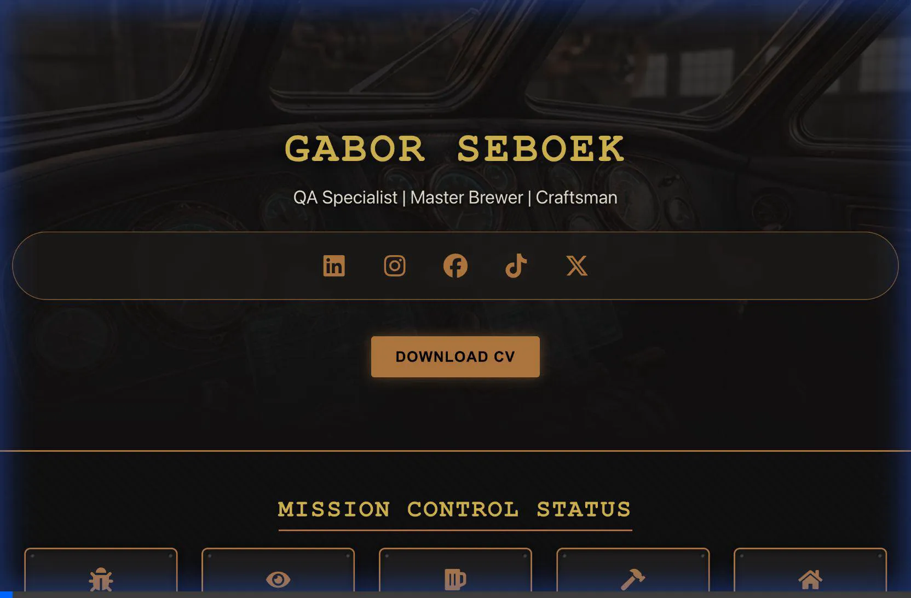

# 🎩 The Gabor Seboek Portfolio ("The Digital HQ")


> **"Where Exactitude Meets Craftsmanship."**

Welcome to the **Monorepo of Competence**. This isn't just a portfolio; it's a **Compliance-Ready, Single-Page Application** designed to demonstrate "Senior QA Specialist" capabilities in a live environment.

It features an **"Elegant Steampunk"** aesthetic (CSS Variables, no frameworks) and acts as a dashboard for my dual life: **High-Tech QA Automation** and **Old-World Craftsmanship**.

---

## 🚀 The "Elevator Pitch" (Why This Codebase Matters)

Recruiters asking "Can you code/test/architect?" --> **Just run this repo.**

*   **Zero-Config Reliability**: Clones and runs instantly.
*   **Shift-Left Quality**: Accessibility (a11y) and Linting strictness are baked into the build pipeline.
*   **360-Degree Validation**: Includes a robust **Playwright E2E Suite** covering Critical User Journeys (CUJs).
*   **Agent-Native**: Built with a "DebugGuide" component that enables AI Agents (via Chrome MCP) to debug the site in real-time.

## 🎥 Live Showcase (30s Tour)
Watch the "Elegant Steampunk" design in action (Smooth Scroll & Video Facade Pattern):


---

## 🛠 The "Stainless Steel" Tech Stack

We chose tools that scream **reliability** and **performance**:

*   **Core**: [React 18](https://react.dev/) + [TypeScript](https://www.typescriptlang.org/) (Strict Mode Enabled).
*   **Build System**: [Vite](https://vitejs.dev/) (Next-gen frontend tooling).
*   **Styling**: **Vanilla CSS Modules** + CSS Variables. (We don't hide behind Tailwind; we architect our own Design Systems).
*   **Testing (The Crown Jewel)**:
    *   **Unit**: [Vitest](https://vitest.dev/) (Jest-compatible).
    *   **E2E**: [Playwright](https://playwright.dev/) (Cross-browser, Mobile/Desktop validation).
*   **DX (Developer Experience)**: Prettier (Auto-format) + ESLint (Standard + Accessibility).

---

## 🕹 Features & Architecture

### 1. The "Cockpit" Dashboard
A visual "Mission Control" displaying real-time (mocked) metrics found in `src/components/Cockpit`.

We use a **Facade Pattern** for video embedding in `src/components/ProjectSection`.
*   *Optimization*: High-Res GenAI Thumbnails load first. YouTube Iframe only loads on interaction (`onClick`).
*   *A11y*: Interactive elements use semantic `<button>` tags.

### 3. The "Agent-Aware" Debug Mode
Hidden in the codebase (and visible in the UI) is `src/components/Guide/DebugGuide.tsx`.
*   *Innovation*: A self-documenting module that teaches developers/agents how to connect to the Chrome DevTools Protocol for live debugging.

### 4. Proof of Verification (Visual Audit)
We don't just say it works; we prove it.

*Above: An automated Agent auditing the "QA Automation Framework" card for interaction and console errors.*

---

## ⚡ Quick Start (The "Happy Path")

Premise: You have `node` (v18+) installed.

1.  **Clone & Install**:
    ```bash
    git clone https://github.com/your-username/GaborPortfolio.git
    cd GaborPortfolio
    npm install
    npx playwright install
    ```

2.  **Ignition (Dev Server)**:
    ```bash
    npm run dev
    # Opens http://localhost:5173
    ```

3.  **The "QA Audit" (Verify Competence)**:
    ```bash
    npm run lint       # 0 Errors Expected
    npm test           # Unit Tests (Green)
    npm run test:e2e   # Full Browser Suite (Green)
    ```

---

## 📂 Documentation & Standards

*   **Blueprint**: See `prompts/master_prompt.md` for the "Regeneration Protocol".
*   **Handling Real-Time Debugging**: See `docs/DEBUGGING_GUIDE.md`.
*   **Collaboration Protocol**: See `docs/COLLABORATION.md`.

---

## 📸 Attribution
*   **Assets**: Generated via "Nanono Banana Pro" (Internal AI Tool) - Prompted for "Elegant Steampunk, Copper, Carbon Fiber".
*   **Icons**: `react-icons` (Fa).

---

> *Built with precision by Gabor Seboek. Tested by Robots. Approved by Humans.*
