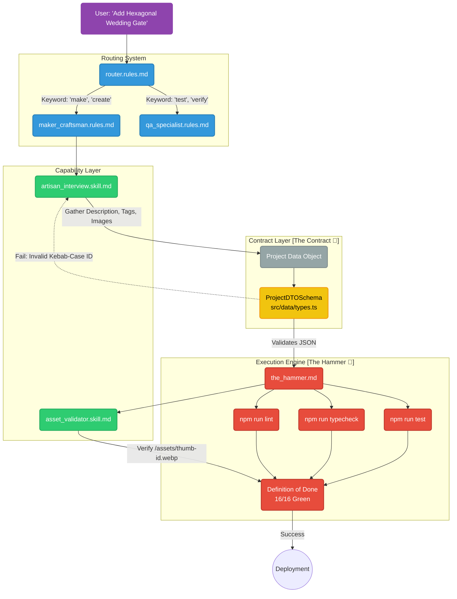

# The Maker Extension Workflow 🛠️

This document visualizes the lifecycle of a task within the GaborPortfolio agentic framework, specifically tracing the path of a "Maker" request.

## Architecture Visualization

## Extensibility Points 🔌

This architecture allows for "Visual Vibe Coding" by extending nodes without rewriting the core logic.

### 1. Adding a New Persona
- **Where**: Create `.agent/rules/new_persona.rules.md`.
- **Link**: Update `router.rules.md` to map new keywords to this file.
- **Visual**: Add a new Blue (`:::role`) node in the Routing System subgraph.

### 2. Adding a New Capability (Skill)
- **Where**: Create `.agent/skills/new_capability.skill.md`.
- **Link**: Reference this skill in the relevant Rules file.
- **Visual**: Add a new Green (`:::skill`) node in the Capability Layer.

### 3. Modifying "The Contract"
- **Where**: Edit `ProjectDTOSchema` in `src/data/types.ts`.
- **Example**: To add a `budget` field for projects, update the Zod object.
- **Visual**: The Yellow (`:::dto`) node represents a gatekeeper. Any data structure changes here automatically update validation logic downstream.

### 4. Strengthening "The Hammer"
- **Where**: Edit `.agent/commands/the_hammer.md` or the underlying scripts.
- **Example**: Add a security audit step.
- **Visual**: Add a new Red (`:::cmd`) node in the Execution Engine subgraph, feeding into the Definition of Done.
