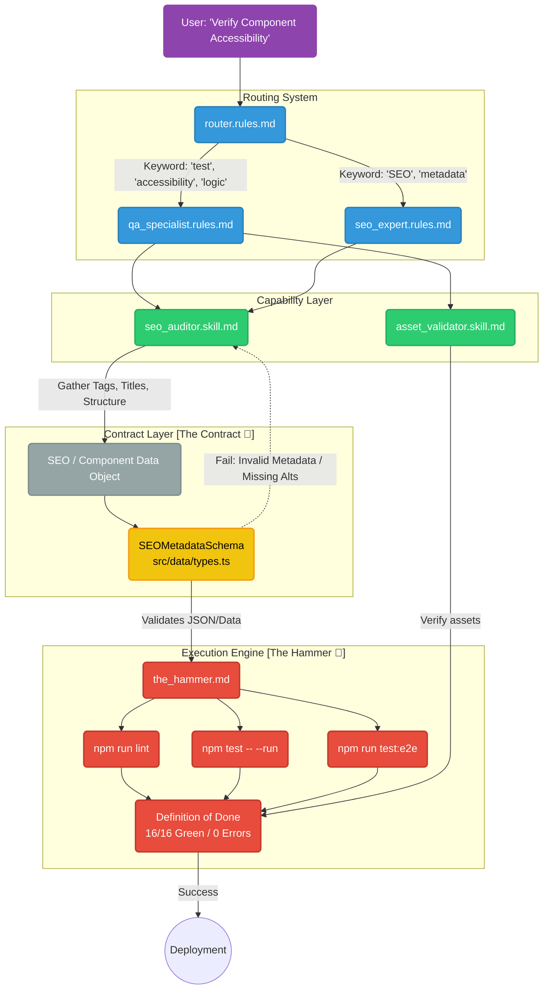

# The Profession Workflow 🛡️

This document visualizes the lifecycle of a task within the GaborPortfolio agentic framework, specifically tracing the path of a "Profession" (QA / Engineering) request.

## Architecture Visualization

## Extensibility Points 🔌

This architecture allows for "Visual Vibe Coding" by extending nodes without rewriting the core logic, enforcing strict QA standards across the portfolio.

### 1. Augmenting the QA Persona
- **Where**: Modify `.agent/rules/qa_specialist.rules.md`.
- **Example**: Add accessibility standard checks (e.g., forcing axe-core compliance).
- **Visual**: Enhances the Blue (`:::role`) node's mandate, dictating stricter routing or new capability requirements.

### 2. Adding a New Test Capability (Skill)
- **Where**: Create `.agent/skills/performance_auditor.skill.md`.
- **Link**: Reference this new auditor in `qa_specialist.rules.md` or `seo_expert.rules.md`.
- **Visual**: Add a new Green (`:::skill`) node in the Capability Layer.

### 3. Modifying "The Contract" for Components
- **Where**: Edit schemas in `src/data/types.ts` (like `SEOMetadataSchema`).
- **Example**: Enforce a new rule where all components must have a strictly typed `aria-label`.
- **Visual**: The Yellow (`:::dto`) node acts as the unbreakable gatekeeper protecting The Hammer from malformed test assertions.

### 4. Strengthening "The Hammer"
- **Where**: Edit `.agent/commands/the_hammer.md` or scripts in `package.json`.
- **Example**: Add Playwright UI snapshot testing or a CI integration step.
- **Visual**: Add a new Red (`:::cmd`) node in the Execution Engine subgraph before the "Definition of Done".
